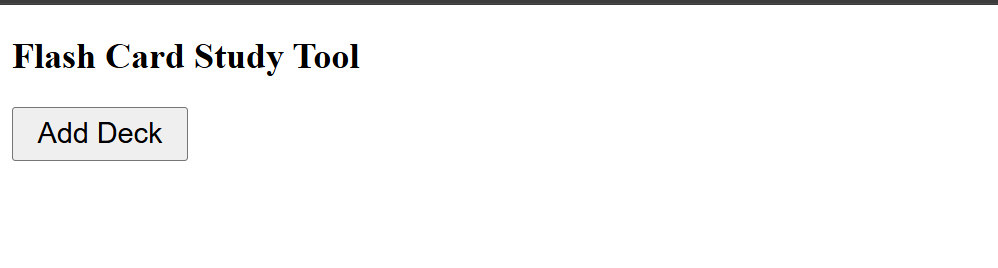
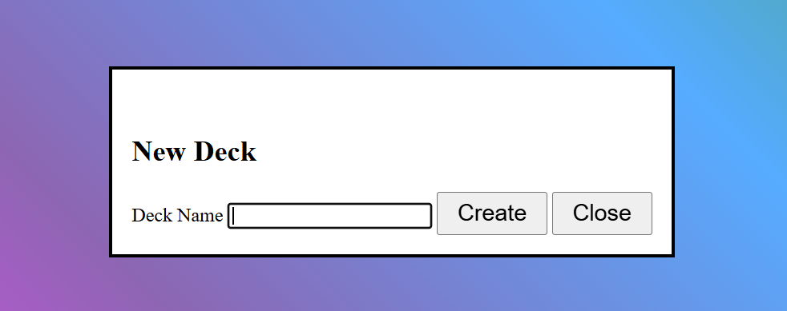
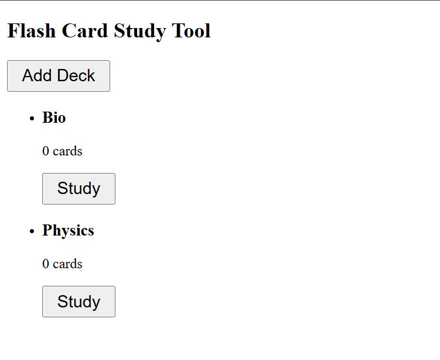
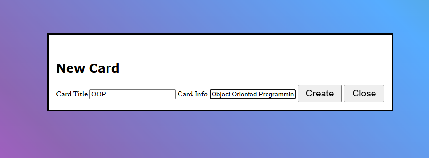
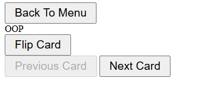

# Flash Cards
A flashcard or flash card is a card bearing information on both sides, usually intended to practice and/or aid memorization.
It can be virtual (part of a flashcard software) or physical.

Typically, each flashcard bears a question or definition on one side and an answer or target term on the other. 
As such, flashcards are often used to memorize vocabulary, historical dates, formulae, or any subject matter that can be learned via a question-and-answer format.
https://en.wikipedia.org/wiki/Flashcard
# Overview
This is a personal study project I am making to learn more about software development.

The motivation for this project was the sorry state of flashcard apps right now. Most of them require making accounts, have limits on the number of cards you can make,
useful features are locked behind paywalls. This is my attempt at making something better

Since this is a learning project no LLMs were used to write any lines of code.

# Progress Tracker

* project will use an MVC architecture
* I am not sure whether to have a split of Notebook/Courses doing that for now might change later
* Set up basic elements and some code, currently doesn't compile
* The next goal is to set up the view/notifier for all the basic building blocks of the website
* Did more research on imperative and declarative programming regarding the DOM and TS in general still struggling with intuition on which to choose
* Worked on the add deck dialog, learned about CSS
* Identified serisous issues with my implementation of MVC and observer pattern worked to fix it 
* Added a Deck Menu and very basic card view with flipping cards 

 

 

