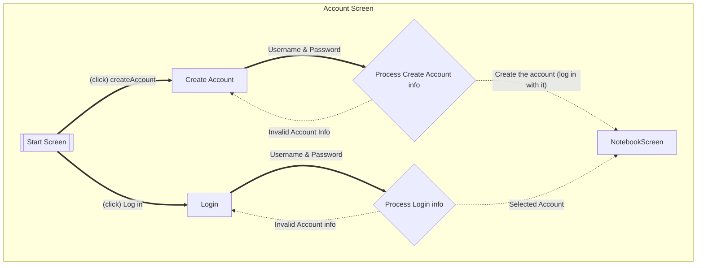
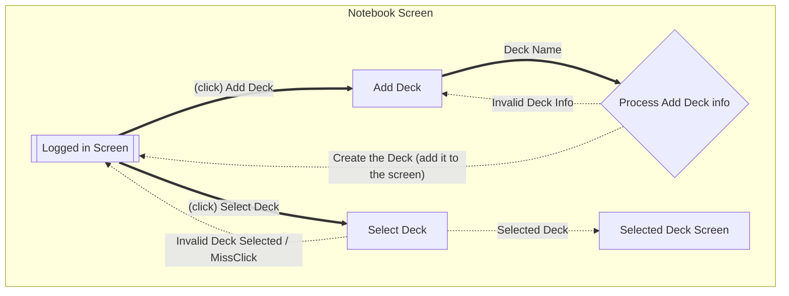

---
Flows of interaction for FlashCard Application
===
Andrii Vdovyniuk
---
date: Aug 5 2026
---
Currently some of the features aren't fully implemented or working on being implemented
TODO start screen with a log in

